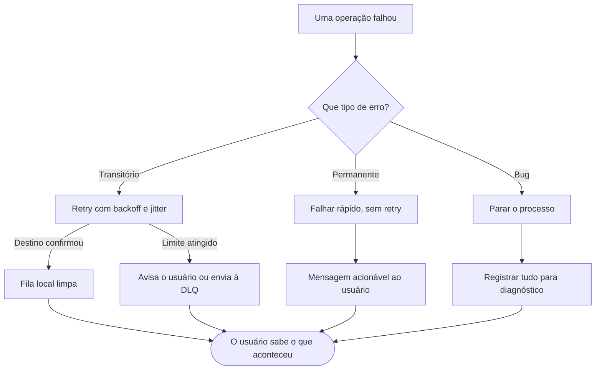

# Diretrizes de Código

**Versão 2.1.0**, de 1º de outubro de 2026. Próxima revisão: 1º de janeiro de 2027. Histórico na seção *Changelog*.

Documento que rege a filosofia e as regras de arquitetura de qualquer código desenvolvido a partir de agora.

Ele tem três partes: princípios (o que fazer e por quê), prática (como verificar no dia a dia) e anexos (modelos prontos para copiar em cada repositório). No dia a dia, a seção *Checklist por nível* é a que se consulta; o resto é referência.

## Sumário

- [Filosofia central](#filosofia-central)
- [Ordem de prioridade e trade-offs](#ordem-de-prioridade-e-trade-offs)
- [Níveis de projeto](#níveis-de-projeto)
- [1. Segurança](#1-segurança)
- [2. Confiabilidade](#2-confiabilidade)
- [3. Simplicidade](#3-simplicidade)
- [4. Modularidade](#4-modularidade)
- [5. Velocidade](#5-velocidade)
- [6. Autonomia](#6-autonomia)
- [Tratamento de erros](#tratamento-de-erros)
- [Front-end e back-end: a divisão de papéis](#front-end-e-back-end-a-divisão-de-papéis)
- [Versionamento e documentação](#versionamento-e-documentação)
- [Mecanismos: regras que não dependem de memória](#mecanismos-regras-que-não-dependem-de-memória)
- [Checklist por nível](#checklist-por-nível)
- [Exceções: quando desviar das diretrizes](#exceções-quando-desviar-das-diretrizes)
- [Métricas e SLOs](#métricas-e-slos)
- [Linguagens e tech stack por contexto](#linguagens-e-tech-stack-por-contexto)
- [Exemplo aplicado: monitor de sistema em Rust](#exemplo-aplicado-monitor-de-sistema-em-rust)
- [Manutenção deste documento](#manutenção-deste-documento)
- [Changelog](#changelog)
- [Glossário](#glossário)
- [Anexos: modelos para cada repositório](#anexos-modelos-para-cada-repositório)
- [Anexo A — README.md](#anexo-a--readmemd)
- [Anexo B — CHANGELOG.md](#anexo-b--changelogmd)
- [Anexo C — docs/adr/0000-modelo.md](#anexo-c--docsadr0000-modelomd)
- [Anexo D — .github/pull_request_template.md](#anexo-d--githubpull_request_templatemd)
- [Anexo E — .githooks/pre-commit](#anexo-e--githookspre-commit)
- [Anexo F — .githooks/pre-push](#anexo-f--githookspre-push)
- [Anexo G — .github/workflows/ci.yml](#anexo-g--githubworkflowsciyml)
- [Anexo H — .github/dependabot.yml](#anexo-h--githubdependabotyml)

## Filosofia central

Seis pilares regem todo código desenvolvido a partir de agora. Em ordem de prioridade: **Segurança, Confiabilidade, Simplicidade, Modularidade, Velocidade e Autonomia**.

Independentemente das interfaces, um computador é, no seu âmago, uma calculadora — e código é apenas um conjunto de instruções sobre como as operações serão realizadas. Por isso, ainda na fase de arquitetura, a estrutura deve ser projetada para que exista a menor quantidade possível de estruturas únicas. O código deve ser modular, facilmente adaptável e o mais autônomo possível.

O compromisso central: se o usuário agiu com a intenção de obter um resultado, existe um mecanismo que garante esse resultado — ou que o avisa explicitamente quando ele não for possível. **Nada se perde em silêncio.**

O front-end deve ser intuitivo, limpo, organizado e fácil de usar. O back-end deve ser confiável, rápido, seguro e sofisticado — sem ser mais complexo do que o problema exige.

As regras são proporcionais ao projeto: um script pessoal não carrega as mesmas exigências de um serviço crítico (ver *Níveis de projeto*).

## Ordem de prioridade e trade-offs

Os seis pilares nem sempre são compatíveis. Quando entram em conflito, vale esta ordem única — a mesma usada na numeração dos pilares:

1. **Segurança**
2. **Confiabilidade**
3. **Simplicidade**
4. **Modularidade**
5. **Velocidade**
6. **Autonomia**

O que cada relação significa na prática:

| Conflito | Regra prática |
| --- | --- |
| Segurança > Confiabilidade | Nunca persistir dados sensíveis sem proteção só para garantir uma entrega. A fila local pode guardar a intenção, não o segredo. |
| Segurança > Simplicidade | Segurança é o lugar onde complexidade extra quase sempre se paga: validação, autenticação e auditoria não são cortadas por elegância. |
| Segurança > Velocidade | Nunca sacrificar segurança por 100 ms. Um sistema rápido e vulnerável é pior que um lento e seguro. |
| Segurança > Autonomia | Não armazenar dados sensíveis localmente só para funcionar offline. |
| Confiabilidade > Simplicidade | Mecanismos de garantia (retry, fila, idempotência) justificam sua complexidade — desde que proporcionais ao nível do projeto. |
| Confiabilidade > Velocidade | Retry com backoff é mais importante que latência mínima. |
| Confiabilidade > Autonomia | Se o modo offline quebra a consistência de dados, preferir online-only com fallbacks de UX. |
| Simplicidade > Modularidade | Não criar abstração antes da necessidade real. Duplicar duas vezes é aceitável; generalizar na terceira. |
| Simplicidade > Velocidade | Otimização que torna o código ilegível exige medição que a justifique. |
| Modularidade > Velocidade | Código compartilhado é o padrão; cópia inline só com profiling que a justifique (ver *Exceções*). |
| Modularidade > Autonomia | Não duplicar código para ganhar independência de um módulo. |

Toda decisão que viole essa ordem **deve** ser documentada no código (comentário ou ADR) explicando por quê.

## Níveis de projeto

Todo repositório declara seu nível no README ao ser criado; o nível define quais exigências deste documento se aplicam. Cada nível herda tudo do anterior.

| Nível | Tipo de projeto | Exemplo | Exige (além do nível anterior) | Dispensa |
| --- | --- | --- | --- | --- |
| 1 | Script ou experimento pessoal: roda só na sua máquina, sem outros usuários | Script de automação, notebook de estudo | Nenhum segredo no código, código legível, README mínimo | Retry, fila, métricas, SLOs, testes de falha |
| 2 | Ferramenta local: outras pessoas usam, rede ausente ou opcional | Monitor de sistema no terminal, app desktop | Tratamento de erros completo, validação de entrada, testes do caminho feliz e das falhas principais, versionamento semântico | Fila de sincronização, DLQ, dashboards |
| 3 | Aplicação com servidor: rede, dados de usuários, sincronização | App com conta de usuário e API própria | TLS, autenticação, retry com backoff, idempotência, fila local persistente, logs estruturados | DLQ com operador, chaos engineering formal |
| 4 | Serviço crítico: dinheiro, dados sensíveis ou muitos usuários | Pagamentos, saúde, infraestrutura de terceiros | Todas as métricas e SLOs, DLQ, auditoria completa, testes de caos, dashboard | Nada |

Quando um projeto muda de natureza (ganha usuários, passa a usar rede), ele sobe de nível e o checklist do novo nível é revisado antes do próximo lançamento. Aplicar exigências de nível 4 a um projeto de nível 1 não é rigor — é complexidade sem justificativa.

O checklist de cada nível, separando o que é verificado automaticamente do que depende de revisão humana, está na seção *Checklist por nível*.

## 1. Segurança

**Princípio:** o código deve ser seguro e restrito por padrão. Endereços e portas são escritos em linguagem fortemente tipada, com campos e variáveis claros e memória bem gerida — preferindo linguagens com garbage collector ou com segurança de memória garantida pelo compilador, como Rust. O código precisa resistir tanto a ações maliciosas quanto a erros não maliciosos: falhas de protocolo, acesso não autorizado a arquivos importantes e engenharia social — quando rotina e familiaridade levam à displicência.

**Diretrizes práticas:**

- **Seguro por padrão.** A configuração padrão é sempre a mais restrita; abrir permissões exige ação consciente, nunca o contrário.
- **Minimização de dados.** Dado que não é coletado não vaza. Coletar e guardar apenas o necessário, pelo tempo necessário.
- **Dados pessoais e LGPD.** No Brasil, a LGPD (Lei 13.709/2018) exige base legal e finalidade definida para tratar dados pessoais, além de atender aos direitos do titular: acesso, correção e exclusão. CPF, email e localização são dados pessoais; saúde, biometria, origem racial ou étnica, religião e opinião política são dados sensíveis, com exigências mais rígidas. A partir do nível 3, o README lista quais dados pessoais o sistema trata, por quê e por quanto tempo.
- **Tipagem forte** sempre que possível: erros de tipo pegos em tempo de compilação eliminam uma classe inteira de bugs antes de o código rodar.
- **Gerenciamento de memória seguro** — garbage collector (Go, Java) ou ownership/borrow checking (Rust). Gerenciamento manual só quando estritamente necessário e justificado.
- **Validação de toda entrada externa** — input do usuário, resposta de API, conteúdo de arquivo. Exemplo: resposta de API passa por validação de schema antes de ser processada. Meta: 100% das entradas externas validadas, conferido em code review.
- **Sanitização contra injeção** (SQL, comando de shell etc.) sempre que dado externo compõe uma query ou comando — preferir queries parametrizadas a concatenar strings.
- **Menor privilégio:** cada processo, serviço ou componente acessa só o que precisa para funcionar.
- **Segredos fora do código:** senhas, tokens e chaves vivem em variáveis de ambiente, cofres de segredos ou arquivos fora do controle de versão.
- **Criptografia em trânsito com TLS** (HTTPS, por exemplo) em toda comunicação de rede, inclusive interna. TCP sozinho é apenas transporte e não protege nada; a rede local não é confiável por padrão.
- **Nunca implementar a própria criptografia.** Usar bibliotecas consolidadas e auditadas.
- **Autenticação e autorização explícitas** em todo endpoint que exponha dado ou ação. Uma URL difícil de adivinhar não é proteção.
- **Falhar alto, nunca em silêncio:** um parâmetro de segurança que deveria estar ativo e não está precisa ser visível e alertado.
- **Proteção contra erro humano:** ações destrutivas ou irreversíveis (deletar, sobrescrever, transferir) exigem confirmação explícita e ficam registradas com quem, quando e por quê. Em nível 4, por exemplo: excluir conta exige digitar "confirmar", código por email e 48 h de carência (soft delete, depois hard delete em background).
- **Cadeia de suprimentos:** lockfile versionado, versões de dependências fixadas e auditoria de vulnerabilidades conhecidas (`cargo audit`, `npm audit`, `pip-audit`), com revisão periódica — mesmo que manual no início.
- **Auditoria:** logs de quem acessou o quê e quando, especialmente para ações e dados sensíveis.

## 2. Confiabilidade

**Princípio:** o código deve cumprir a intenção que levou o usuário a agir. Um botão "Enviar" não cumpre sua função só por disparar a rotina: o dado precisa efetivamente chegar ao destino. Para isso, o sistema automatiza o retry até cumprir o objetivo, com mecanismos de verificação que evitam excesso de tentativas e overhead.

**A garantia, em termos honestos:** entrega exatamente uma vez é impossível em sistemas distribuídos. O que se garante é entrega *pelo menos uma vez* somada a idempotência — o que, na prática, produz efeito único. Quando nem isso for possível, o usuário é avisado. A promessa é: **nada se perde em silêncio**.

**Diretrizes práticas:**

- **Classificar o erro antes de tentar de novo.** Só erros transitórios recebem retry; erros permanentes falham rápido e bugs param o processo (ver *Tratamento de erros*). Sem essa distinção, o retry esconde bugs em vez de cumprir a intenção do usuário.
- **Garantia de entrega para toda ação do usuário.** Exemplo: "Enviar formulário" → dado persistido localmente → envio com retry → sucesso limpa a fila local. Falha após retries esgotados → usuário notificado com opção de tentar de novo ou descartar.
- **Retry com backoff exponencial e jitter:** 1 s, 2 s, 4 s, 8 s, 16 s, com variação aleatória de ±20% para evitar que todos os clientes tentem ao mesmo tempo (*thundering herd*).
- **Limite de tentativas:** após N falhas, alertar o usuário ou operador — nunca tentar indefinidamente sem retorno. Exemplo: 5 retries ≈ 31 s; depois, a operação vai para uma DLQ (*Dead Letter Queue*) e o operador é notificado (nível 4).
- **Idempotência:** toda operação sujeita a retry pode ser executada mais de uma vez sem duplicar efeito. Exemplo: `POST /transfer` com header `Idempotency-Key: <uuid>`; o servidor devolve o resultado anterior se já processou aquela chave.
- **Confirmação explícita do destino:** "a requisição foi enviada" nunca é sinônimo de "a operação foi concluída".
- **Persistência local como rede de segurança:** se o destino está inacessível, a intenção do usuário fica gravada em fila local até poder ser entregue. O usuário nunca repete uma ação por falha de rede.
- **Timeouts em toda chamada externa**, com comportamento definido e tratado para o que acontece depois do timeout.
- **Consistência de estado:** operações com múltiplos passos são transações — tudo é aplicado ou nada é. Nunca um estado intermediário inconsistente.
- **Recuperação na inicialização:** ao reiniciar após uma queda, o programa verifica o estado deixado para trás (fila pendente, transação incompleta) e o resolve antes de aceitar novas ações.
- **Testes dos caminhos de falha**, não só do caminho feliz: rede caindo no meio, resposta corrompida, timeout, reinício inesperado. Mínimo de 3 cenários de falha por operação crítica.

### Observabilidade

Observabilidade é como se verifica que a confiabilidade existe de fato, e não só no papel.

- **Logs estruturados de toda falha e todo retry:** timestamp, tentativa N, erro específico, tempo de backoff, idempotency-key e identificador do usuário.
- **Diagnóstico sem reprodução:** qualquer falha deve ser investigável pelos logs, sem precisar fazer o problema acontecer de novo.
- **Métricas proporcionais ao nível:** em nível 2, logs legíveis bastam; em nível 4, busca estruturada e alertas automáticos (ver *Métricas e SLOs*).

## 3. Simplicidade

**Princípio:** toda complexidade precisa justificar sua existência. O código mais confiável, seguro e rápido é aquele que não precisou ser escrito. Antes de adicionar uma camada, um módulo ou uma dependência, pergunta-se se o problema realmente exige essa solução — ou se existe uma forma mais direta de chegar ao mesmo resultado.

Os outros cinco pilares dizem *o que* o sistema deve fazer, e cada um, levado ao extremo, acrescenta complexidade: mais retries, mais camadas, mais otimização, mais cache, mais abstração. Simplicidade é o único que subtrai — é o regulador dos demais.

**Diretrizes práticas:**

- **Código é lido muito mais vezes do que escrito.** Clareza vale mais que esperteza: um trecho "genial" que ninguém entende em seis meses (inclusive o autor) é um passivo.
- **Resolver o problema que existe, não o que pode vir a existir (YAGNI).** Abstração só depois da necessidade real — o que sustenta a regra da terceira repetição em *Modularidade*.
- **Cada componente deve caber na cabeça.** Se entender uma função ou módulo exige manter muitas coisas na memória ao mesmo tempo, ele precisa ser dividido ou repensado.
- **Nomes que dispensam comentário.** Comentários explicam o *porquê*; o *o quê* deve estar claro pelo próprio código.
- **Remover é progresso.** Apagar código morto, dependências sem uso e funcionalidades abandonadas conta como trabalho produtivo.
- **Proporcionalidade:** o nível do projeto define o teto de complexidade aceitável (ver *Níveis de projeto*).

## 4. Modularidade

**Princípio:** um código modular segue a filosofia de "galhos" — minimizar o código de função única escrito repetidamente para problemas específicos. Ao se observar serviços e funções que compartilham lógica *e mudam pelo mesmo motivo*, essas estruturas são unificadas e reaproveitadas. A arquitetura de cada repositório deve deixar claro que estimula a modularidade.

**Diretrizes práticas:**

- **Duplicação acidental vs. essencial.** Dois trechos iguais hoje só são unificados se mudam pelo mesmo motivo. Uma validação de cadastro e uma de pagamento que coincidem por acaso devem continuar separadas: unificá-las cria acoplamento, e mexer em uma quebra a outra.
- **Regra da terceira repetição.** Duplicar uma vez é aceitável. A terceira ocorrência de um mesmo padrão é o sinal para extrair uma estrutura compartilhada — não antes, não depois (ver o caso dos sensores em *Exemplo aplicado*).
- **Antes de escrever uma função nova,** verificar se um padrão semelhante já existe. Exemplo: validações de email, CPF e telefone reunidas num módulo `validators` com interface única, recebendo a entrada e o tipo e devolvendo sucesso ou erro tipado.
- **Interfaces claras:** cada módulo expõe um contrato bem definido (entradas, saídas, comportamento esperado) e esconde os detalhes da própria implementação.
- **Baixo acoplamento, alta coesão:** um módulo pode ser testado, substituído ou reescrito individualmente sem quebrar o resto do sistema.
- **Um bom módulo é fácil de deletar,** não só de reaproveitar. Se remover um módulo exige mexer em dezenas de lugares, o acoplamento está alto demais.
- **Dependências apontam para o estável:** módulos de negócio dependem de interfaces, não de detalhes de implementação (banco, rede, interface gráfica).
- **Módulos combináveis:** novos recursos nascem estendendo e combinando módulos existentes, não criando ramos paralelos que duplicam responsabilidade.
- **Documentar a arquitetura** de cada repositório — quais são os módulos, o que cada um faz e como se conectam — para quem chegar depois, inclusive o próprio autor meses depois.
- **Meta:** índice de duplicação abaixo de 5% (medido com ferramentas como SonarQube ou jscpd), a partir do nível 3.

## 5. Velocidade

**Princípio:** os sistemas buscam celeridade, praticidade e estruturas enxutas. Scripts (`.sh` ou equivalentes) servem para tarefas do dia a dia sem variação. Linguagens compiladas, arquiteturas monolíticas e estruturas bem escolhidas garantem código-objeto mínimo e eficiente.

**Diretrizes práticas:**

- **Algoritmo antes de linguagem.** A complexidade algorítmica pesa mais que a escolha entre compilado e interpretado: um O(n²) em Rust perde para um O(n log n) em Python quando os dados crescem. Escolher a estrutura de dados certa é a primeira otimização.
- **Medir antes de otimizar:** usar profiling para achar o gargalo real antes de investir em otimização manual. A arquitetura, porém, já nasce favorecendo estruturas leves, e não como remendo tardio.
- **Linguagens compiladas** para componentes de longa duração ou alto desempenho (serviços, engines, daemons). Linguagens interpretadas ficam para automação pontual, prototipagem e ecossistemas onde são padrão (como machine learning).
- **Velocidade percebida:** feedback imediato na interface muitas vezes importa mais que milissegundos no back-end. Mostrar progresso, responder ao clique na hora e processar em segundo plano reduzem o desgaste cognitivo do usuário.
- **Minimizar dependências pesadas:** cada dependência é peso extra no binário, na superfície de ataque e no tempo de build. Antes de adicionar uma, verificar se a biblioteca padrão resolve; toda dependência nova é justificada no PR.
- **I/O costuma ser o gargalo, não a CPU:** priorizar cache com invalidação inteligente, operações assíncronas e agrupamento de requisições. Exemplo: listar 1.000 itens com uma consulta em lote (`WHERE id IN (...)`), não com 1.000 requisições individuais.
- **Evitar runtimes pesados** (como um motor de navegador completo embutido) quando o objetivo é rodar em hardware modesto ou como serviço leve.
- **Tamanho vs. velocidade, por escolha consciente:** otimizar para binário menor ou para execução mais rápida conforme o cenário exige — nunca por inércia.
- **Arquitetura monolítica por padrão:** um único programa bem modularizado internamente tem menos overhead e é mais previsível que vários serviços conversando pela rede. Distribuir só quando escala ou isolamento exigirem.

## 6. Autonomia

**Princípio:** buscando segurança, menor overhead, aproveitamento máximo do hardware disponível e compatibilidade com máquinas antigas, o client deve ser autossuficiente para realizar localmente tudo o que se espera dele, minimizando a dependência de nuvem. Em caso de perda de conexão, o usuário não tem retrabalho: o cache garante que sincronização e transmissão aconteçam automaticamente quando a conexão voltar.

**O limite teórico:** o teorema CAP mostra que, durante uma falha de rede, um sistema distribuído precisa escolher entre continuar disponível e manter todos os dados consistentes. Autonomia total e consistência total não coexistem sempre. A classificação abaixo é a resposta prática a esse limite: ela define, operação por operação, qual dos dois vence.

### Operações: offline, online ou híbrido

| Categoria | Operações | Comportamento sem conexão |
| --- | --- | --- |
| Pode ser offline | Leitura de dados já sincronizados; criação de rascunhos; configurações locais (temas, preferências); validação de formato (email, CPF); cálculos e agregações locais | Funciona normalmente; sincroniza depois |
| Sempre online | Autenticação e renovação de sessão; autorização; operações financeiras ou que alteram estado crítico; confirmação de idempotência; leitura de dados que precisam estar atualizados (saldo, disponibilidade) | Fila persistente + erro explícito ao usuário |
| Híbrido | Criação de entidade que precisa de ID do servidor; atualizações frequentes e tolerantes a atraso (comentários, curtidas) | Tenta local, valida online depois |

Quem implementar uma feature offline **deve** documentar em qual categoria ela cai.

**Diretrizes práticas:**

- **Funcionalidade essencial sem rede:** a experiência não depende de conexão para tarefas que, por natureza, não exigem validação externa em tempo real.
- **Fila local persistente:** toda ação pendente fica gravada de forma durável e sobrevive a reinício do programa e da máquina — nunca só em memória.
- **Sincronização automática e transparente:** ao reconectar, o sistema reenvia o pendente sem ação manual do usuário.
- **Detecção real do estado de conexão:** o sistema verifica se está online, em vez de assumir, e comunica o estado quando ele importa para a ação em curso.
- **Resolução de conflitos definida com antecedência:** se o mesmo dado pode mudar localmente e no servidor antes da sincronização, existe uma regra clara — nunca comportamento indefinido.
- **Cuidado com "a última escrita vence":** essa regra depende de relógios, e relógios de máquinas diferentes divergem. Para dados editados em vários dispositivos, preferir *vector clocks* ou CRDTs, que resolvem conflitos sem depender de horário; para casos ambíguos, sinalizar para revisão manual.
- **Autonomia também frente a fornecedores:** preferir dependências e formatos que funcionam sem um serviço externo específico, evitando que a queda ou o fim de um terceiro pare o sistema.
- **Consumo consciente de recursos:** cache e fila local têm tamanho máximo e política de expiração — autossuficiência não é acúmulo ilimitado.
- **Hardware modesto como critério de arquitetura**, desde o início, e não como otimização posterior.

## Tratamento de erros

Todo erro pertence a uma de três classes, e a classe decide a reação. Tratar todos da mesma forma — seja tentando de novo, seja ignorando — é a origem das falhas silenciosas. A classificação aplicada a um projeto real está em *Exemplo aplicado*.

| Classe | Exemplos | Reação correta |
| --- | --- | --- |
| Transitório | Rede caiu, servidor sobrecarregado, timeout, recurso temporariamente ocupado | Retry com backoff exponencial e limite de tentativas |
| Permanente | Dado inválido, permissão negada, recurso inexistente, erro 4xx | Falhar rápido, sem retry, e informar o usuário com mensagem acionável |
| Bug | Estado impossível, invariante violada, valor que o código garantia não existir | Parar o processo e registrar tudo; nunca insistir nem mascarar |

Os três caminhos terminam no mesmo lugar:



**Diretrizes práticas:**

- **Propagar ou tratar, nunca engolir.** Cada função trata o erro que sabe resolver e propaga o resto para quem sabe. Um `catch` vazio ou um erro descartado é proibido.
- **Erros como valores tipados** sempre que a linguagem permitir (`Result` em Rust, por exemplo): o compilador obriga a lidar com a falha.
- **Contexto em cada propagação:** ao repassar um erro, acrescentar o que se tentava fazer ("falha ao ler config em ~/.app/config.toml"), não só a causa crua.
- **Mensagem ao usuário ≠ mensagem de log.** O usuário recebe o que aconteceu e o que pode fazer; o log recebe os detalhes técnicos. Detalhes internos nunca vazam para a interface.
- **Panic/abort só para bugs.** Erros esperados (arquivo ausente, rede fora) nunca derrubam o programa.

## Front-end e back-end: a divisão de papéis

As duas propostas são a aplicação dos seis pilares em cada lado da fronteira entre o que o usuário vê e o que o sistema executa.

- **Front-end** — intuitivo, limpo, organizado e fácil de usar. A proposta é garantir, com o menor desgaste cognitivo possível, que o usuário tenha uma experiência completa.
- **Back-end** — confiável, rápido, seguro e sofisticado. A proposta é garantir que as ações que o usuário pretendia realizar sejam levadas à conclusão — ou que ele seja avisado quando isso não for possível.

### Critérios de menor desgaste cognitivo

- **Estado sempre visível:** o usuário sabe se uma ação está em andamento, concluída, pendente (offline) ou falhou — sem precisar adivinhar.
- **Feedback em menos de 100 ms** para qualquer interação, mesmo que o resultado final demore.
- **Consistência:** o mesmo elemento tem a mesma aparência e o mesmo comportamento em toda a interface.
- **Uma ação principal por tela:** o caminho mais comum é o mais visível; opções avançadas ficam acessíveis, mas não competem com ele.
- **Reconhecer em vez de lembrar:** opções, valores anteriores e contexto ficam à vista, sem exigir que o usuário memorize.
- **Erros acionáveis:** toda mensagem de erro diz o que aconteceu e o que fazer em seguida.
- **Ações desfazíveis** sempre que possível; quando não, confirmação explícita (ver *Segurança*).
- **Acessibilidade:** contraste adequado, navegação completa por teclado, textos alternativos e suporte a leitores de tela (referência: WCAG 2.2, nível AA).

## Versionamento e documentação

Todo repositório, de qualquer nível, é compreensível por alguém que nunca o viu — incluindo o próprio autor daqui a seis meses.

- **README mínimo obrigatório:** o que o projeto faz, nível do projeto, como instalar, como rodar e como testar. Modelo no *Anexo A*.
- **Commits pequenos e descritivos:** cada commit faz uma coisa e explica o porquê. Um padrão como Conventional Commits (`feat:`, `fix:`, `refactor:`) facilita gerar changelog.
- **Versionamento semântico** (MAJOR.MINOR.PATCH) a partir do nível 2: MAJOR quebra compatibilidade, MINOR adiciona recurso, PATCH corrige bug.
- **CHANGELOG** a partir do nível 2, com o que mudou em cada versão, na visão de quem usa. Modelo no *Anexo B*.
- **ADRs (Architecture Decision Records)** para decisões arquiteturais e desvios destas diretrizes: contexto, decisão, alternativas consideradas e consequências. Modelo no *Anexo C*.
- **Documentação perto do código:** comentários de documentação nas interfaces públicas de cada módulo; documentação separada só para visão geral e arquitetura.

## Mecanismos: regras que não dependem de memória

Este documento exige que a intenção do usuário seja garantida por um mecanismo, e não por boa vontade. A mesma regra vale para ele: toda diretriz que uma ferramenta consegue verificar é verificada por uma ferramenta, e o que exige julgamento humano vai para o *Checklist por nível*.

| Regra | Mecanismo | Quando roda |
| --- | --- | --- |
| Código formatado e sem avisos do linter | `cargo fmt --check` e `cargo clippy -- -D warnings` | Hooks e CI (anexos E e G) |
| Segredos fora do repositório | Hook bloqueia `.env`, `.pem`, `.key`, `.p12`, `.pfx` e chaves SSH no commit | Hook de pre-commit (anexo E) |
| Testes passando | `cargo test` | Hook de pre-push e CI (anexos F e G) |
| Vulnerabilidades conhecidas em dependências | `cargo audit` | Hook de pre-push, se instalado, e CI (anexos F e G) |
| Dependências atualizadas | Dependabot abre pull requests semanais (crates) e mensais (GitHub Actions) | No GitHub, automaticamente (anexo H) |
| Nível declarado, README completo e decisões registradas | Modelos de README, CHANGELOG, ADR e pull request (anexos A a D) | Ao criar o repositório e a cada pull request |
| Itens que exigem julgamento | *Checklist por nível* | Antes de commits relevantes e de cada versão |

**Para aplicar a um repositório Rust:**

1. Copie cada anexo para o caminho indicado no título dele, sem sobrescrever arquivos que já existam no repositório.
2. Torne os hooks executáveis: `chmod +x .githooks/pre-commit .githooks/pre-push`. O Git registra essa permissão, então ela vale para quem clonar depois.
3. Ative os hooks: `git config core.hooksPath .githooks`. Essa configuração não viaja com o repositório: depois de clonar em outra máquina, o comando precisa ser repetido (o README do modelo lembra disso).

Os hooks podem ser pulados com `--no-verify` em emergência. O CI repete as mesmas verificações no GitHub, então nada chega ao ramo principal sem passar por elas. O CI usa apenas a action oficial `actions/checkout` e instala o resto pelo `rustup` e pelo `cargo`, para manter pequena a superfície de cadeia de suprimentos.

## Checklist por nível

Cada nível inclui tudo dos níveis anteriores.

**Legenda:** **[hook]** verificado automaticamente no commit ou no push; **[CI]** verificado no GitHub; **[manual]** depende de você.

### Nível 1: script ou experimento pessoal

- [ ] Nível do projeto declarado no README **[manual]**
- [ ] Nenhum segredo no código ou no repositório **[hook]**
- [ ] Código formatado e sem avisos do linter **[hook] [CI]**
- [ ] README diz o que o projeto faz e como rodar **[manual]**
- [ ] Nomes claros; comentários explicam o porquê, não o quê **[manual]**

### Nível 2: ferramenta local

- [ ] Nenhum `unwrap`/`expect` sobre dado externo (arquivo, entrada do usuário, saída de outro programa) **[manual]**
- [ ] Erros novos classificados: transitório, permanente ou bug **[manual]**
- [ ] Toda entrada externa validada **[manual]**
- [ ] Testes do caminho feliz e das falhas principais passando **[hook] [CI]**
- [ ] Dependências sem vulnerabilidade conhecida **[hook] [CI]**
- [ ] Ações destrutivas pedem confirmação **[manual]**
- [ ] "Carregando", "sem dado" e "erro" nunca parecem iguais na interface **[manual]**
- [ ] Versão semântica e CHANGELOG atualizados a cada lançamento **[manual]**

### Nível 3: aplicação com servidor

- [ ] Toda comunicação de rede com TLS **[manual]**
- [ ] Autenticação e autorização em todo endpoint **[manual]**
- [ ] Retry com backoff e jitter apenas para erros transitórios, com limite de tentativas **[manual]**
- [ ] Operações de mutação idempotentes **[manual]**
- [ ] Fila local persistente para ações pendentes **[manual]**
- [ ] Timeout em toda chamada externa **[manual]**
- [ ] Logs estruturados de falhas e retries **[manual]**
- [ ] Toda feature offline classificada: offline, online ou híbrida **[manual]**
- [ ] Dados pessoais listados no README conforme a LGPD: quais, por quê e por quanto tempo **[manual]**

### Nível 4: serviço crítico

- [ ] SLOs definidos e painel publicado **[manual]**
- [ ] DLQ com operador notificado **[manual]**
- [ ] Auditoria de acesso a dados e ações sensíveis **[manual]**
- [ ] Pelo menos 3 cenários de falha testados por operação crítica **[manual]**
- [ ] Vulnerabilidades críticas corrigidas em até 24 h **[manual]**

### Antes de cada versão, em qualquer nível

- [ ] CHANGELOG atualizado **[manual]**
- [ ] Todo desvio das diretrizes registrado em ADR ou comentário **[manual]**
- [ ] Dependências sem uso removidas **[manual]**
- [ ] O nível do projeto continua o mesmo? Se mudou, percorrer o checklist do novo nível **[manual]**

## Exceções: quando desviar das diretrizes

Desvios são permitidos apenas se cumprirem as quatro condições:

1. **Risco < benefício:** a vantagem de desviar (ex.: 2 s de latência economizados) supera o risco (ex.: 0,01% de dados inconsistentes).
2. **Documentado:** existe comentário no código, ADR ou issue explicando por que a diretriz foi violada.
3. **Monitorado:** existe métrica ou alerta que detecta se o desvio saiu do controle (ex.: "se inconsistência > 0,1%, alertar").
4. **Temporário ou aceito:** o desvio tem data de revisão ou é uma decisão arquitetural deliberada e registrada.

**Exemplos de exceções legítimas:**

- **Segurança vs. Simplicidade:** um endpoint de verificação de saúde (`/health`) que devolve apenas "ok" pode dispensar autenticação, desde que não exponha nenhum dado interno e isso esteja explícito na documentação.
- **Confiabilidade vs. Velocidade:** uma operação pode abrir mão do retry automático se o usuário pode tentar de novo com um clique e o retry automático causaria efeito indesejado (ex.: comprar item com estoque muito baixo).
- **Autonomia vs. Segurança:** um app pode permitir login local offline, mas deve exigir reautenticação ao reconectar.
- **Modularidade vs. Velocidade:** código em caminho crítico de desempenho pode ter uma cópia inline de função comum se o profiling mostrar ganho real. Marcar com `// PERF: inline no hot-path, ver <issue>`.

Desvios não documentados encontrados em code review bloqueiam o merge.

## Métricas e SLOs

As metas são pontos de partida, ajustados ao contexto, e só se aplicam a partir do nível indicado. Abaixo dele, são referência, não obrigação.

| Pilar | Métrica | Meta | A partir do nível |
| --- | --- | --- | --- |
| Segurança | Vulnerabilidades críticas em dependências | Nenhuma sem correção há mais de 24 h | 3 |
| Segurança | Entradas externas com validação | 100% | 2 |
| Segurança | Ações destrutivas com confirmação | 100% das operações irreversíveis | 2 |
| Confiabilidade | Operações entregues com sucesso | > 99,9% | 3 |
| Confiabilidade | Tempo até falha detectada e alertada | < 5 min | 4 |
| Confiabilidade | Falhas investigáveis pelos logs | 100%, com rastro completo | 3 |
| Confiabilidade | Operações que chegam à DLQ | Alertar se > 1% | 4 |
| Confiabilidade | Cobertura de testes (branches) | > 80% | 3 |
| Confiabilidade | Cenários de falha testados por operação crítica | ≥ 3 | 3 |
| Simplicidade | Dependências sem uso | Zero | 2 |
| Modularidade | Índice de duplicação | < 5% | 3 |
| Velocidade | Latência P95 de I/O | < 100 ms (P99 < 500 ms) | 3 |
| Velocidade | Tamanho do binário ou bundle | Alertar se subir > 10% sem justificativa | 2 |
| Autonomia | Sincronizações offline bem-sucedidas | > 95% | 3 |
| Autonomia | Tempo até sincronizar após reconexão | < 30 s | 3 |

A partir do nível 4, cada repositório mantém um painel com essas métricas (Grafana, Datadog ou, no mínimo, uma seção atualizada no README).

## Linguagens e tech stack por contexto

As diretrizes não prescrevem linguagem; este é um guia aproximado. A escolha final considera também o ecossistema do problema e o que o autor já domina.

| Contexto | Recomendado | Aceitável | Evitar |
| --- | --- | --- | --- |
| Back-end e serviços | Go (compilado, leve, concorrência nativa, memória gerenciada); Rust (quando consumo de memória e latência importam) | Java/Kotlin, se o tamanho do runtime for aceitável | Python em serviços críticos de longa duração |
| Ferramentas de terminal e sistema (CLI/TUI, daemons) | Rust, Go | C, com justificativa documentada | Linguagens com runtime pesado |
| Front-end web | TypeScript + React, Vue ou Svelte | JavaScript puro para páginas muito simples | JavaScript sem tipagem em projetos que vão crescer |
| Apps multiplataforma com modo offline | Flutter, React Native; Tauri para desktop (usa o webview do sistema) | — | Electron em hardware modesto (embute um navegador completo) |
| Machine learning e ciência de dados | Python (ecossistema padrão: PyTorch, NumPy) | — | Reimplementar em outra linguagem o que o ecossistema já resolve |
| Scripts e automação do dia a dia | Bash para tarefas curtas e sem variação; Python quando houver lógica, parsing ou tratamento de erros | — | Scripts Bash longos com lógica complexa |

Regra para scripts: se um script Bash passa de ~50 linhas ou precisa de estruturas de dados, ele deve ser reescrito em uma linguagem com tipagem e tratamento de erros de verdade.

## Exemplo aplicado: monitor de sistema em Rust

As diretrizes aplicadas a um projeto concreto: um monitor de sistema para terminal (TUI) que exibe uso e temperatura da CPU, uso das GPUs integrada e dedicada, RAM e swap. Esta seção foi escrita a partir da descrição do projeto, não do código; as decisões devem ser conferidas na primeira revisão de projeto (ver *Manutenção deste documento*).

**Nível:** 1 enquanto só o autor usar; 2 a partir do momento em que for publicado para outras pessoas instalarem. O README declara qual dos dois vale.

| Pilar | Decisão concreta |
| --- | --- |
| Segurança | Roda sem root e lê apenas `/proc` e `/sys`; nunca pede `sudo`. O conteúdo desses arquivos é entrada externa e muda entre versões do kernel, então todo parsing devolve erro tipado em vez de usar `unwrap`. Toda crate nova passa por `cargo audit`. |
| Confiabilidade | A intenção do usuário é ver números corretos e atuais. Um valor que não pôde ser lido nunca aparece como se fosse atual: após falhas seguidas, ele é marcado como desatualizado. Ao sair, inclusive por panic, o terminal é restaurado (modo raw e tela alternativa desligados) — um terminal quebrado é uma falha silenciosa. |
| Simplicidade | Começa lendo `/proc` e `/sys` diretamente, sem crates de abstração de hardware, até surgir uma necessidade real. Um único binário, sem arquivo de configuração na primeira versão. |
| Modularidade | CPU, RAM, GPU integrada e GPU dedicada seguem o mesmo ciclo (ler, interpretar, exibir): são quatro ocorrências do mesmo padrão, então uma interface única de sensor se justifica pela regra da terceira repetição. Já os limites de alerta de temperatura da CPU e da GPU parecem iguais, mas mudam por motivos diferentes — cada fabricante define o seu —, então ficam separados. |
| Velocidade | O monitor não pode consumir o recurso que mede: meta de menos de 1% de CPU com atualização a cada 1 s, conferida com profiling. Para a GPU NVIDIA, consultar a biblioteca NVML em vez de executar `nvidia-smi` a cada ciclo, o que criaria um processo novo por segundo. O histórico dos gráficos usa um buffer circular de tamanho fixo (inserção O(1)), e não um vetor que remove o primeiro elemento (O(n)). |
| Autonomia | Funciona sem rede por natureza. Se o driver da NVIDIA não estiver carregado, o restante continua funcionando e a GPU dedicada aparece como indisponível. Roda em TTY, sem ambiente gráfico. |

**Classificação de erros no monitor:**

| Situação | Classe | Reação |
| --- | --- | --- |
| Sensor inexistente nesta máquina (sem GPU dedicada, driver ausente) | Permanente | Exibir "indisponível" e parar de consultar esse sensor |
| Leitura que falhou uma vez (arquivo ocupado, consulta à NVML demorou) | Transitório | Tentar de novo no próximo ciclo; marcar como desatualizado após 3 falhas seguidas |
| Valor impossível vindo do sistema (uso de 250%) | Permanente, para aquela leitura | Descartar a leitura, registrar em log e manter o último valor válido, marcado como desatualizado |
| Invariante interna violada (índice fora do histórico) | Bug | Restaurar o terminal, registrar e encerrar |

**Interface (TUI):** "0%" e "sem leitura" nunca têm a mesma aparência. Faixas de alerta usam cor e também símbolo, para não depender só da cor. Todos os comandos funcionam pelo teclado, e a ajuda fica a uma tecla de distância.

## Manutenção deste documento

Este documento segue as próprias regras: é versionado, tem changelog e passa por revisão periódica.

- **Versionamento:** MAJOR quando a ordem de prioridade muda ou uma regra é removida; MINOR quando uma regra ou seção é adicionada; PATCH para correções de texto e de exemplos. O histórico fica na seção *Changelog*.
- **Revisão trimestral:** a cada três meses, reler o documento inteiro e cortar o que não foi usado. Próxima revisão: 1º de janeiro de 2027.
- **Revisão ao fim de cada projeto**, com as respostas registradas na seção *Changelog*:
    1. Que regra ajudou de verdade?
    2. Que regra atrapalhou ou foi ignorada, e por quê?
    3. Que situação apareceu sem que o documento tivesse orientação?
- **Regra nunca aplicada é hipótese.** Uma diretriz que passa duas revisões seguidas sem uso é candidata a remoção.
- **Exemplos reais substituem exemplos genéricos:** a cada revisão de projeto, trechos de antes e depois do próprio código entram no lugar dos exemplos inventados.

## Changelog

Formato baseado em [Keep a Changelog](https://keepachangelog.com/pt-BR/1.1.0/); regras de versão em *Manutenção deste documento*.

### [2.1.0] - 2026-10-01

#### Alterado

- Pacote unificado em um único documento: checklist e changelog viram seções; modelos, hooks e CI viram anexos.
- O script `aplicar-modelo.sh`, que dependia da pasta de modelos, foi substituído por três passos manuais na seção *Mecanismos*.

#### Adicionado

- Diagrama do fluxo de tratamento de erros em Mermaid, no lugar do `diagrama.html`.
- Sumário.

### [2.0.0] - 2026-10-01

#### Alterado

- Pilares reordenados por prioridade, com uma ordem única de trade-offs: Segurança, Confiabilidade, Simplicidade, Modularidade, Velocidade e Autonomia.
- Garantia de entrega reescrita em termos alcançáveis: pelo menos uma vez, somada a idempotência.
- Métricas e SLOs passam a valer a partir de um nível de projeto definido.

#### Adicionado

- Pilar Simplicidade, como regulador dos demais.
- Níveis de projeto, com exigências proporcionais ao tipo de projeto.
- Adendos nos pilares: seguro por padrão, minimização de dados, cadeia de suprimentos, classificação de erros, recuperação na inicialização, observabilidade, algoritmo antes de linguagem, velocidade percebida, teorema CAP, vector clocks e CRDTs, duplicação acidental vs. essencial.
- Seções de tratamento de erros, critérios de desgaste cognitivo, versionamento e documentação, mecanismos, exemplo aplicado, manutenção e glossário.
- Menção à LGPD em Segurança.
- `CHECKLIST.md`, `modelo-repositorio/` (hooks, CI, Dependabot, modelos de README, CHANGELOG, ADR e pull request), `aplicar-modelo.sh` e `diagrama.html`.

#### Corrigido

- TCP deixou de ser citado como protocolo seguro; TLS é o que protege.
- Exemplo da API do Twitter substituído, já que a v2 exige autenticação.
- "Kernels monolíticos" corrigido para "arquitetura monolítica".
- Metas de cobertura de testes unificadas e movidas para Confiabilidade.
- Referência de acessibilidade atualizada para WCAG 2.2.
- "Borraschos" corrigido para "rascunhos"; seção de tech stack, que estava incompleta, concluída.

### [1.0.0]

- Versão original: cinco pilares, framework online/offline, exceções, métricas e tech stack.

## Glossário

| Termo | Significado |
| --- | --- |
| ADR (Architecture Decision Record) | Registro curto de uma decisão de arquitetura: contexto, decisão, alternativas e consequências. |
| Backoff exponencial | Esperar intervalos que dobram entre tentativas (1 s, 2 s, 4 s…), para não sobrecarregar quem está falhando. |
| CI (integração contínua) | Servidor que roda verificações (build, testes, lints) automaticamente a cada push ou pull request. |
| CRDT | Estrutura de dados que pode ser alterada em vários lugares ao mesmo tempo e mesclada depois sem conflito e sem depender de relógio. |
| DLQ (Dead Letter Queue) | Fila para onde vão as operações que esgotaram as tentativas, à espera de análise. |
| Garbage collector | Componente do runtime que libera automaticamente a memória que o programa não usa mais. |
| Hook (Git) | Script que o Git executa automaticamente em certos momentos, como antes de um commit ou de um push. |
| Hot path | Trecho de código executado com tanta frequência que domina o desempenho total. |
| Idempotência | Propriedade de uma operação que produz o mesmo efeito, seja executada uma ou várias vezes. |
| Jitter | Variação aleatória somada ao tempo de espera, para que clientes diferentes não tentem de novo no mesmo instante. |
| LGPD | Lei Geral de Proteção de Dados (Lei 13.709/2018), que regula o tratamento de dados pessoais no Brasil. |
| Lockfile | Arquivo que registra a versão exata de cada dependência (`Cargo.lock`, `package-lock.json`), garantindo builds reproduzíveis. |
| Ownership e borrow checker | Regras do compilador Rust que garantem, antes de o programa rodar, que cada dado tem um único dono e que nenhuma referência aponta para memória já liberada. |
| P95 / P99 | Valor abaixo do qual ficam 95% / 99% das medições. Mostra o pior caso comum, que a média esconde. |
| Profiling | Medição de onde um programa realmente gasta tempo e memória. |
| Schema validation | Verificação de que um dado tem a estrutura e os tipos esperados antes de ser usado. |
| SLO (Service Level Objective) | Meta numérica de qualidade de um serviço, como "99,9% das operações entregues". |
| Soft delete / hard delete | Marcar um dado como excluído sem apagá-lo / apagá-lo de fato. |
| Teorema CAP | Durante uma falha de rede, um sistema distribuído precisa escolher entre manter os dados consistentes e continuar disponível. |
| Thundering herd | Muitos clientes tentando de novo ao mesmo tempo e derrubando o servidor que acabou de voltar. |
| TLS | Protocolo que criptografa e autentica a comunicação em rede; é o "S" de HTTPS. |
| TUI | Interface em modo texto que ocupa o terminal inteiro, com painéis e navegação por teclado. |
| Vector clock | Vetor com um contador por participante que permite saber se uma edição aconteceu antes de outra, ou ao mesmo tempo, sem depender de relógio físico. |
| Versionamento semântico | Número de versão MAJOR.MINOR.PATCH que comunica o tipo de mudança: quebra de compatibilidade, recurso novo ou correção. |
| YAGNI ("You Aren't Gonna Need It") | Princípio de não construir o que ainda não é necessário. |

## Anexos: modelos para cada repositório

Cada anexo vai para o caminho indicado no título, a partir da raiz do repositório. Instruções de instalação em *Mecanismos*.

## Anexo A — `README.md`

````markdown
# Nome do projeto

Uma frase dizendo o que o projeto faz e para quem.

## Nível do projeto

**Nível X**: motivo em uma linha. Exigências de cada nível nas Diretrizes de Código.

## Status

Em desenvolvimento, estável ou arquivado. O que já funciona hoje, em uma ou duas frases.

## Instalação

Passos para instalar, incluindo dependências de sistema.

## Uso

Comando principal e um exemplo real de uso.

## Desenvolvimento

Depois de clonar, ative os hooks (a configuração não vem junto com o repositório):

```sh
git config core.hooksPath .githooks
```

Testes: `cargo test`. Auditoria de dependências: `cargo install cargo-audit --locked` (uma vez), depois `cargo audit`.

## Arquitetura

| Módulo | Responsabilidade | Depende de |
| --- | --- | --- |
| `exemplo` | O que este módulo faz | Outros módulos ou crates |

## Dados pessoais (nível 3 ou mais)

| Dado | Por que é tratado | Por quanto tempo |
| --- | --- | --- |
| Exemplo: email | Login e recuperação de senha | Enquanto a conta existir |

## Decisões

Decisões de arquitetura e desvios das diretrizes ficam em `docs/adr/`.

## Licença

Nome da licença.
````

## Anexo B — `CHANGELOG.md`

```markdown
# Changelog

Formato baseado em [Keep a Changelog](https://keepachangelog.com/pt-BR/1.1.0/); versões seguem o [versionamento semântico](https://semver.org/lang/pt-BR/).

## [Não lançado]

### Adicionado

### Alterado

### Corrigido

### Removido

### Segurança
```

## Anexo C — `docs/adr/0000-modelo.md`

Copie para um arquivo novo a cada decisão (`0001-...md`, `0002-...md`), mantendo este como modelo.

```markdown
# 0000. Título da decisão

- **Status:** proposta, aceita ou substituída por NNNN
- **Data:** AAAA-MM-DD

## Contexto

Que problema ou restrição motivou a decisão.

## Decisão

O que foi decidido, em uma ou duas frases.

## Alternativas consideradas

- Alternativa A: por que não foi escolhida.

## Consequências

O que fica mais fácil e o que fica mais difícil a partir daqui.

## Desvio das diretrizes (preencher só se houver)

- **Pilar e regra afetados:**
- **Risco vs. benefício:**
- **Monitoramento:** que métrica ou alerta detecta se o desvio saiu do controle.
- **Revisão em:** AAAA-MM-DD, ou "decisão permanente".
```

## Anexo D — `.github/pull_request_template.md`

```markdown
## O que muda e por quê

## Nível do projeto

## Checklist

Formatação, lints, testes e auditoria de dependências são verificados pelo CI.

- [ ] Itens do checklist do nível revisados (Diretrizes de Código, seção *Checklist por nível*)
- [ ] Erros novos classificados: transitório, permanente ou bug
- [ ] Entradas externas novas validadas
- [ ] Nenhum desvio das diretrizes, ou desvio registrado em ADR
- [ ] CHANGELOG atualizado na seção "Não lançado"
```

## Anexo E — `.githooks/pre-commit`

```bash
#!/usr/bin/env bash
# Verificações rápidas antes de cada commit (Diretrizes de Código: Mecanismos).
# Em emergência: git commit --no-verify. O CI repete estas verificações no GitHub.
set -euo pipefail

falhou=0

echo "==> Arquivos sensíveis"
sensiveis="$(git diff --cached --name-only --diff-filter=ACMR \
  | grep -E '(^|/)(\.env(\.[^/]*)?|[^/]*\.(pem|key|p12|pfx)|id_(rsa|ecdsa|ed25519))$' \
  | grep -vE '(^|/)\.env\.example$' || true)"
if [ -n "$sensiveis" ]; then
  echo "[ERRO] Arquivos sensíveis no commit:"
  echo "$sensiveis"
  echo "       Remova com 'git rm --cached <arquivo>' e adicione-os ao .gitignore."
  falhou=1
fi

if [ -f Cargo.toml ]; then
  echo "==> cargo fmt"
  cargo fmt --all -- --check || falhou=1
  echo "==> cargo clippy"
  cargo clippy --all-targets --all-features -- -D warnings || falhou=1
fi

if [ "$falhou" -ne 0 ]; then
  echo "[ERRO] Commit bloqueado. Corrija os itens acima e tente de novo." >&2
  exit 1
fi
echo "[OK] Verificações de commit passaram."
```

## Anexo F — `.githooks/pre-push`

```bash
#!/usr/bin/env bash
# Verificações completas antes de enviar ao GitHub (Diretrizes de Código: Mecanismos).
# Em emergência: git push --no-verify. O CI repete estas verificações no GitHub.
set -euo pipefail

if [ ! -f Cargo.toml ]; then
  exit 0
fi

echo "==> cargo test"
cargo test --all-features

if command -v cargo-audit >/dev/null 2>&1; then
  echo "==> cargo audit"
  cargo audit
else
  echo "[AVISO] cargo-audit não está instalado; a auditoria só vai rodar no CI."
  echo "        Para instalar: cargo install cargo-audit --locked"
fi
echo "[OK] Verificações de push passaram."
```

## Anexo G — `.github/workflows/ci.yml`

```yaml
# Repete no GitHub as verificações dos hooks locais (Diretrizes de Código: Mecanismos).
# Usa só a action oficial actions/checkout; o resto vem do rustup e do cargo,
# para manter pequena a superfície de cadeia de suprimentos.
name: CI

on:
  push:
    branches: [main]
  pull_request:

permissions:
  contents: read

env:
  CARGO_TERM_COLOR: always

jobs:
  verificacoes:
    name: Formatação, lints e testes
    runs-on: ubuntu-latest
    timeout-minutes: 20
    steps:
      - uses: actions/checkout@v4
      - name: Preparar Rust estável
        run: |
          rustup toolchain install stable --profile minimal --component rustfmt --component clippy
          rustup default stable
      - name: Formatação
        run: cargo fmt --all -- --check
      - name: Lints
        run: cargo clippy --all-targets --all-features -- -D warnings
      - name: Testes
        run: cargo test --all-features

  auditoria:
    name: Auditoria de dependências
    runs-on: ubuntu-latest
    timeout-minutes: 15
    steps:
      - uses: actions/checkout@v4
      - name: Preparar Rust estável
        run: |
          rustup toolchain install stable --profile minimal
          rustup default stable
      - name: Instalar cargo-audit
        run: cargo install cargo-audit --locked
      - name: Auditar
        run: cargo audit
```

## Anexo H — `.github/dependabot.yml`

```yaml
# Mantém dependências e actions atualizadas (Diretrizes de Código: cadeia de suprimentos).
version: 2
updates:
  - package-ecosystem: cargo
    directory: "/"
    schedule:
      interval: weekly
    open-pull-requests-limit: 5
  - package-ecosystem: github-actions
    directory: "/"
    schedule:
      interval: monthly
```
